# About
A small DIY project to control the power button of a desktop computer as well as
monitor the status of its power LED remotely via a network connection. It mainly
consists of:
* a circuit diagram based on an ESP32 MicroController Unit (MCU) board
* a firmware build setup based on [ESPHome][esphome], ready-to-deploy on the
  aforementioned ESP32 MCU board

The whole circuit can easily fit inside the case of a standard desktop computer,
be connected to the relevant motherboard headers and be controlled via Wi-Fi
over the network by means of the [ESPHome API interface][esphome-api], which is
implemented by [the `aioesphomeapi` Python module][aioesphomeapi] as well as by
the widely known home automation systems [Home Assistant][homeassistant] and
[OpenHAB][openhab].

As a result, using intuitive controls like switches and dashboards in the
aforementioned home automation systems, it is possible to remotely check the
actual status of the computer power LED as well as electrically activate its
power button (which, in all respects, is equivalent to mechanically pushing it).
All with on-premises software components and no cloud services involved.

The whole setup requires limited skills and is extensively described in this
guide.\
Based on my own technological setup, I will be covering the case of using
OpenHAB as interface to control the board. Remote operation, even over the
Internet, can be safely accomplished in a variety of ways, which are out of the
scope of this documentation: essentially, secured IP reachability between the
user and the board is required, and you may likely want to use a VPN for this.


# :warning: Disclaimer :warning:
This is a home-made project leveraging electrical connections to your desktop
computer. Although its design makes it beyond substantially safe to be operated,
no responsibility is assumed for any damage that might derive from implementing
it.\
No reasons to alarm, but you know what you are doing.


# Table of Contents
* [Rationale](#rationale)
* [Features & Limitations](#features--limitations)

- [Bill of Materials](#bill-of-materials)
- [Setup](#setup)
  1. [Building and Flashing the Custom
     Firmware](#1-building-and-flashing-the-custom-firmware)
  2. [Building the Circuit](#2-building-the-circuit)
  3. [Setting up Controls in OpenHAB](#3-setting-up-controls-in-openhab)

* [Future Extensions](#future-extensions)
* [References](#references)

<br />

# Rationale
It is well known that [WakeOnLAN (WoL)][wakeonlan] is the reference standard to
remotely power on a properly set up desktop computer: I also extensively use it
whenever possible. Nevertheless, two major reasons fostered inception of this
little project.

_Reason #1_ &ndash; Both the BIOS/UEFI and the operating system must enable the
Network Interface Card (NIC) to wake up the machine upon receiving Magic Packets
for WoL to operate. While this is commonly true, several factors may potentially
prevent WoL from working. Among them:
* Windows _fast startup_, which puts the system in a special "quick" power-down
  state after shutdown, that may impair processing of Magic Packets
* the variety of ACPI power states, for which WoL may need to be selectively
  enabled (at the BIOS/UEFI and/or driver level): notably, they include S3
  (_standby_), S4 (_hibernate_) and S5 (_soft off_); even more, WoL may never be
  effective for remotely waking from state S0 (_low power idle_, induced by the
  _modern standby_ sleep state), because in this state the machine only reacts
  to other events such as a Remote Desktop connection (see the [relevant
  Microsoft documentation][modern-standby-wake])
* default operational modes enforced by the NIC driver, as mentioned for example
in the [Arch Linux Wake-on-LAN documentation][arch-linux-wol]:
  > Depending on the hardware, the network driver may have WoL switched off by
  > default

In the end, care must be taken to consistently enable WoL and test its operation
(before walking away from the target machine).

_Reason #2_ &ndash; In some cases the NIC firmware may fail to initialize the
physical port or just enter WoL listening mode after  power outages. In such
cases, the only recovery action is to physically push the power button, which
defeats the primary purpose of WoL.\
Differently from _Reason #1_, this condition may not be avoidable with software
settings: a NIC replacement (or addition) can be attempted, but with no
guarantees of success. 

Moreover, checking if the computer has been powered on can only be achieved via
ICMP ping, which requires a working operating system and an assigned IP address
(note that checking the network link status from a managed switch - in case one
is available - is ineffective because it may be up even during soft off).
Finally, network-based technologies are not helpful in remotely restoring a
frozen workstation (for example, due to a kernel panic): this usually requires
physically activating the reset button or long-pushing the power button to
trigger a forced workstation shutdown.


# Features & Limitations
:white_check_mark: Here is a list of reasons why this little project may come
handy:
  * always-on low-power system, making out-of-band monitoring and activation of
    the desktop computer power continuously available
  * no requirements on the controlled desktop computer in terms of:
    * operating system: it can be any or missing altogether
    * networking: the computer may even be isolated from the network
    * management interface: relies solely on electrical connections to the
      commonly available "front panel" header on the desktop computer
      motherboard (which is generally available to support connection of case
      buttons and LEDs); no need for special interfaces/protocols like
      IPMI/iDRAC/iLO
  * no drivers needed (except for first-time board firmware setup)
  * works even in case of a desktop computer OS crash/freeze
  * existing hardware power button and LED are untouched and nicely coexist with
    this system
  * board circuit isolated from the motherboard's using opto-isolators
    (photocouplers)
  * (near-)real time reporting of the power LED status including, e.g., blinking
  * board conveniently powered via USB and controlled via Wi-Fi
  * Wi-Fi access through a static IP address of your choice, to avoid any
    reliance on external DHCP servers (of course this behavior can be reverted
    if desired)
  * no interactions with public cloud services (unless intentionally set up in
    ways that exceed this documentation); can operate in the absence of an
    Internet connection (i.e., over the local network)
  * integration with home automation systems ([Home Assistant][homeassistant],
    [OpenHAB][openhab]), enabling arbitrary routines (e.g., scheduled wake up or
    shutdown)
  * embedded power button logic to simulate a momentary press (power on or ACPI
    shutdown) or a long press (forced shutdown): no need to manually implement
    it on the controlling home automation system

:no_entry: On the other hand, this project cannot knowingly address the
following use cases:
  * remote control of a laptop computer, or any other workstation that has no
    connections for an external physical power button and LED (some NUCs may
    fall in this case - but WoL usually works better for these devices)
  * remote reporting of "fancy" power LED states (e.g., pulsing, fading): in
    such cases the LED will be reported as fully bright or dark depending on
    whether a voltage threshold is passed or not
  * remote video capture and/or simulation of input peripherals
    (keyboard/mouse): you may want to have a look at [PiKVM][pikvm] instead


# Bill of Materials
The following is a list of components I have been using to build the board. You
may of course choose others, but then the circuit may need to be adjusted
accordingly.
- 1 × ESP32 development board &mdash; I am using [AZ-Delivery's NodeMCU Dev Kit
  C v2][azdelivery-mcu] ([documentation][azdelivery-mcu-docs]), which has the
  following main features:
  - [Espressif `ESP32-WROOM-32`][esp32-wroom-32-docs] chip
    - up to 240MHz clock
    - 512kB RAM
    - 4MB flash memory
  - 34 I/O pins
  - 2.4GHz 802.11b/g/n Wi-Fi
  - Bluetooth 4.2
- 2 × photocouplers (I am using [Sharp `PC817`][sharp-pc817] units)
- 1 × 470Ω resistor
- 1 × 220Ω resistor
- 1 × USB 2.0 cable with a micro-B terminal connector (used to power the board
  and access its serial interface)

If, like me, you are going to run the circuit on a breadboard, you may also need:
- 1 × breadboard (large enough to accommodate the ESP32 board plus a few extra
  components)
- jumper wires (of different lengths and with different combinations of
  male/female connectors)

# Setup
Setting up the whole system consists of the following steps:
1. [Building and Flashing the Custom Firmware](#1-building-and-flashing-the-custom-firmware)
   to the board
2. [Building the Circuit](#2-building-the-circuit)
3. [Setting up Controls in OpenHAB](#3-setting-up-controls-in-openhab)


## 1. Building and Flashing the Custom Firmware
:information_source: _Note_ &mdash; For extra safety, in order to prevent any
forms of damage to the ESP32 board components, I suggest executing this step
_before_ building the circuit. This ensures that I/O pins behave as expected
once connected.

### Firmware Descriptor Files
The custom `pc-power-board` firmware image needs to be generated by compiling
it. Since it is based on [ESPHome][esphome], the build process is very
convenient as there is no real "source code": firmware generation is based only
on a set of mostly self-explaining YAML declaration files (which, of course, are
part of this project). The file structure is as follows:
* `pc-power-board.yaml` is the entry point which is meant to be processed by the
  `esphome` command line utility; it contains basic configuration settings, a
  setup of build-time variables and pointers to the other YAML files; since
  variables can be conveniently altered by using `esphome` command line options,
  this file is usually not meant to be edited
* `secrets-template.yaml` contains a skeleton for user-specific security
  parameters for Wi-Fi access (PSK), ESPHome API encryption and OTA
  (Over-The-Air) firmware flash password protection; a copy of this file named
  `secrets.yaml` is meant to be edited to adapt it to your needs
* `board-settings.yaml` applies board chipset settings as well as Wi-Fi, API
  encryption and OTA password protection settings obtained from file
  `secrets.yaml`; this file is not meant to be edited
* `sensors.yaml` is where the full board logic resides: it specifies the setup
  of GPIO pins and of the power switch logic and defines other useful "sensors"
  to monitor the board health status; this file is usually not meant to be
  edited

### How to Flash the `pc-power-board` Firmware
First of all, you need to adjust a few settings to customize the firmware image
for your own use.\
Copy file `secrets-template.yaml` to `secrets.yaml`, then edit file
`secrets.yaml` to set your Wi-Fi SSID and credentials, as well as API encryption
key and OTA password protection:
* API encryption key can be an arbitrary 32-byte base64-encoded string (a
  convenient generator can be found [here][esphome-api-key-generator]). Once
  set, the same key must be used in the controlling application (e.g.,
  [OpenHAB][openhab])
* OTA password can be an arbitrary string. Once set, future attempts to flash
  the firmware using the OTA (Over-The-Air) mechanism over Wi-Fi will require
  authentication using this password: `esphome` automates this process because
  the same password from `secrects.yaml` that is written to the board when
  flashing the firmware will be retrieved and sent to the board to authenticate
  any future attempts to flash the same board. You should be aware that:
  * if you ever need to change the OTA password in the future, you cannot simply
    alter the setting in `secrets.yaml`, as authentication during the firmware
    flash stage would fail: the ESPHome documentation suggests a strategy for
    dynamically [updating the password][esphome-ota-password-update] at runtime
  * having an OTA password set in `secrets.yaml` should still work if the board
    is running an ESPHome firmware that does not require authentication at all
    for OTA update (like, for example, the firmware flashed using the [Web
    tool](#flashing-a-basic-firmware-using-the-web-tool) method explained
    below): this allows a convenient first-time setting of the OTA password via
    Wi-Fi

Deploying the custom `pc-power-board` firmware image on the board can be carried
out using different methods, as specified in the following table (notice how the
build step is implicitly comprised whenever applicable):

| Flash method                                              | Build step included      | Physical USB connection required |
| :---                                                      | :---:                    | :---:                            |
| [Web tool](#flashing-a-basic-firmware-using-the-web-tool) | :x:<br/>(does not apply) | :white_check_mark:               |
| [`esphome` via USB](#flashing-using-esphome-via-usb)      | :white_check_mark:       | :white_check_mark:               |
| [`esphome` via Wi-Fi](#flashing-using-esphome-via-wi-fi)  | :white_check_mark:       | :x:                              |

Choosing the flash method(s) depends on the firmware that is already running on
the board. Here are the options (those <mark>highlighted</mark> are advised
because slightly more convenient):

| Current firmware                             | Target firmware  | Flash process                                                                                                                                                                                                                 |
| :---                                         | :---             | :---                                                                                                                                                                                                                          |
| Any, including foreign/stock                 | `pc-power-board` | 1. <mark>[Web tool](#flashing-a-basic-firmware-using-the-web-tool), then [`esphome`via Wi-Fi](#flashing-using-esphome-via-wi-fi)</mark> (two-steps) or<br/>2. [`esphome` via USB](#flashing-using-esphome-via-usb) (one-step) |
| `pc-power-board`* or<br/>other ESPHome image | `pc-power-board` | 1. <mark>[`esphome` via Wi-Fi](#flashing-using-esphome-via-wi-fi)</mark> or<br/>2. [`esphome` via USB](#flashing-using-esphome-via-usb)                                                                                       |

\* This row applies, for example, when you need to alter the configuration of an
already flashed `pc-power-board` firmware.

The above tables reflect the fact that first-time flashing an ESPHome-based
firmware (like `pc-power-board`) requires a physical connection to the board via
USB, whereas subsequent flashes can be conveniently performed in OTA
(Over-The-Air) mode via Wi-Fi, as specified in the
[documentation][esphome-board-connection].

Instructions to connect the board via USB, as well as the flash methods, are
described below.

#### How to connect the ESP32 board via USB
This guide assumes that the ESP32 board has a USB connector giving access to an
internal USB-to-serial interface for accessing the basic board functions.
* Connect the ESP32 board via USB to a desktop computer or laptop: this will
  immediately power the ESP32 board and provide access to its integrated
  USB-to-serial interface
* Check whether the board's serial adapter has been successfully recognized. The
  steps to do so vary depending on the operating system: in Windows you can
  check whether an additional `COM` port has appeared in the Device Manager
* In case the serial port is not recognized, consider installing the [CP210x
  driver][cp210x-driver] (or another that applies for the USB-to-serial
  converter embedded in the board you are using)
* Take note of the detected `COM` port number

#### (Optional) Checking the currently running firmware
ESP32 boards may leave the factory with a minimal preloaded firmware. Although
completely optional, you may want to check which firmware the board is running
before overwriting it.
* Connect the board via USB (see [How to connect the ESP32 board via
  USB](#how-to-connect-the-esp32-board-via-usb))
* Open a terminal emulator ([PuTTY][putty] is perfectly fine for this purpose),
  select the newly detected `COM` port and set the baud rate to `115200`
* Reset the ESP32 board by pushing the `RST` button on the board itself, in
  order to be able to see boot-time messages. \
  Verify the firmware image currently loaded on the board: ESPHome can be easily
  recognized by nicely colored output lines; if, instead, you see a monochrome
  output similar to the following, then the board is running the stock firmware:

  <details>
  <summary>(click to expand) Sample boot log for stock firmware</summary>

  ```
  ets Jul 29 2019 12:21:46

  rst:0x1 (POWERON_RESET),boot:0x13 (SPI_FAST_FLASH_BOOT)
  configsip: 0, SPIWP:0xee
  clk_drv:0x00,q_drv:0x00,d_drv:0x00,cs0_drv:0x00,hd_drv:0x00,wp_drv:0x00
  mode:DIO, clock div:2
  load:0x3fff0018,len:4
  load:0x3fff001c,len:5564
  load:0x40078000,len:0
  load:0x40078000,len:13756
  entry 0x40078fb4
  I (29) boot: ESP-IDF v3.0.3 2nd stage bootloader
  I (29) boot: compile time 08:53:32
  I (29) boot: Enabling RNG early entropy source...
  I (34) boot: SPI Speed      : 40MHz
  I (38) boot: SPI Mode       : DIO
  I (42) boot: SPI Flash Size : 4MB
  I (46) boot: Partition Table:
  I (49) boot: ## Label            Usage          Type ST Offset   Length
  I (57) boot:  0 phy_init         RF data          01 01 0000f000 00001000
  I (64) boot:  1 otadata          OTA data         01 00 00010000 00002000
  I (72) boot:  2 nvs              WiFi data        01 02 00012000 0000e000
  I (79) boot:  3 at_customize     unknown          40 00 00020000 000e0000
  I (87) boot:  4 ota_0            OTA app          00 10 00100000 00180000
  I (94) boot:  5 ota_1            OTA app          00 11 00280000 00180000
  I (102) boot: End of partition table
  I (106) boot: No factory image, trying OTA 0
  I (111) esp_image: segment 0: paddr=0x00100020 vaddr=0x3f400020 size=0x200f4 (131316) map
  I (166) esp_image: segment 1: paddr=0x0012011c vaddr=0x3ffc0000 size=0x02d6c ( 11628) load
  I (171) esp_image: segment 2: paddr=0x00122e90 vaddr=0x40080000 size=0x00400 (  1024) load
  I (173) esp_image: segment 3: paddr=0x00123298 vaddr=0x40080400 size=0x0cd78 ( 52600) load
  I (203) esp_image: segment 4: paddr=0x00130018 vaddr=0x400d0018 size=0xdf390 (914320) map
  I (524) esp_image: segment 5: paddr=0x0020f3b0 vaddr=0x4008d178 size=0x01f14 (  7956) load
  I (527) esp_image: segment 6: paddr=0x002112cc vaddr=0x400c0000 size=0x00064 (   100) load
  I (539) boot: Loaded app from partition at offset 0x100000
  I (539) boot: Disabling RNG early entropy source...
  >>>>>>>>>>>> Messages from the actually flashed firmware begin here
  Bin version(Wroom32):1.1.2
  I (660) wifi: wifi firmware version: de47fad
  I (660) wifi: config NVS flash: enabled
  I (660) wifi: config nano formating: disabled
  I (670) wifi: Init dynamic tx buffer num: 32
  I (671) wifi: Init data frame dynamic rx buffer num: 32
  I (671) wifi: Init management frame dynamic rx buffer num: 32
  I (676) wifi: wifi driver task: 3ffdecc0, prio:23, stack:3584
  I (681) wifi: Init static rx buffer num: 10
  I (685) wifi: Init dynamic rx buffer num: 32
  I (689) wifi: wifi power manager task: 0x3ffdfd8c prio: 21 stack: 2560
  I (743) wifi: mode : softAP (d4:8c:49:58:1d:75)
  I (751) wifi: mode : sta (d4:8c:49:58:1d:74) + softAP (d4:8c:49:58:1d:75)
  I (755) wifi: mode : softAP (d4:8c:49:58:1d:75)
  ```

  </details>

#### Flashing a Basic Firmware Using the Web Tool
This procedure explains how to apply a base ESPHome firmware image to the board:
starting from this you will be able to perform following firmware flashes using
the OTA (Over-The-Air) mechanism over Wi-Fi.
* Connect the board via USB (see [How to connect the ESP32 board via
  USB](#how-to-connect-the-esp32-board-via-usb))
* Open page https://web.esphome.io/ using a Chrome-based web browser (see the
  [compatibility matrix][webserial-compatibility-matrix]) and follow the
  instructions:\
  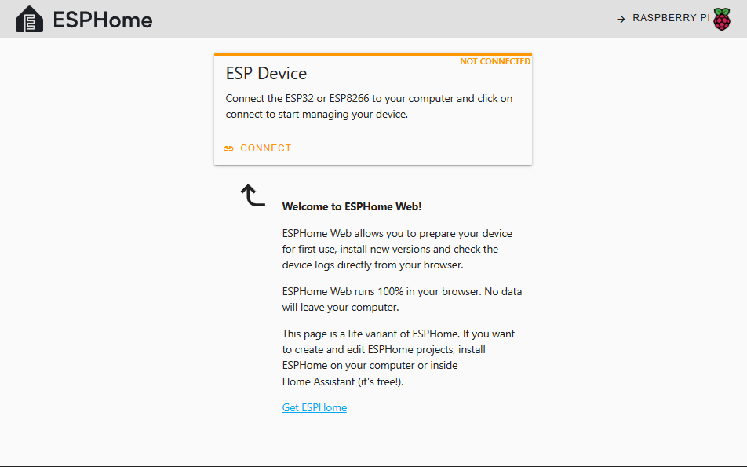\
  This web page is backed by an implementation of the
  [esp-web-tools][esp-web-tools], a suite of software pieces that leverage
  [mechanisms by which a web page can access a physically attached
  USB/serial/HID device][google-usb-serial-hid], obviously after getting the
  user's consent:\
  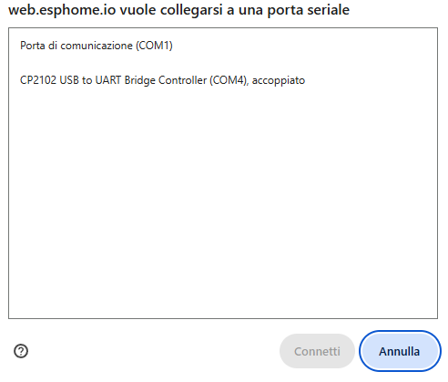\
  After selecting the applicable serial port, click on "Prepare for first use"
  and wait for the firmware to be flashed. \
  :information_source: _Note_ &mdash; Sometimes, enabling the ESP32 board to accept a new firmware
  may require pressing the `BOOT` button on the board while it is being powered
  on: only after doing so you can click on "Prepare for first use". Please try
  and check whether this is needed.\
  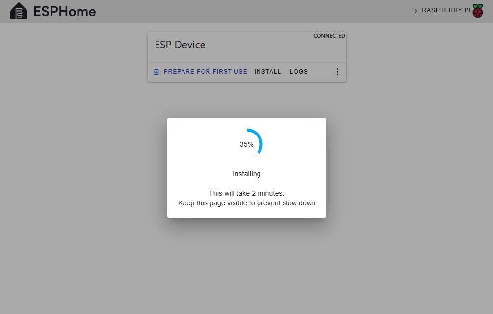\
  After flashing the firmware you can click on the three dots in the web page
  toolbar to access the Wi-Fi configuration wizard. This enables network access
  to the board:\
  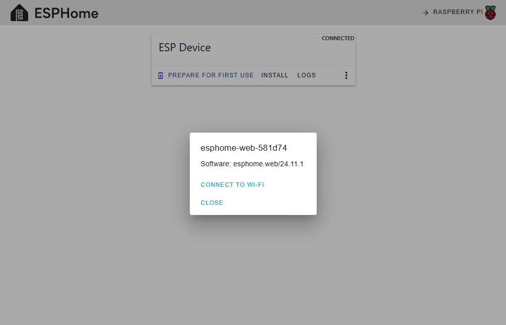\
  Take note of the IP address that has been assigned to the board (for example
  by checking the DHCP lease on your home router): you will need it later on. To
  further confirm that the basic ESPHome firmware has been flashed successfully,
  you should be able to access a simple web page exposed by the board itself:\
  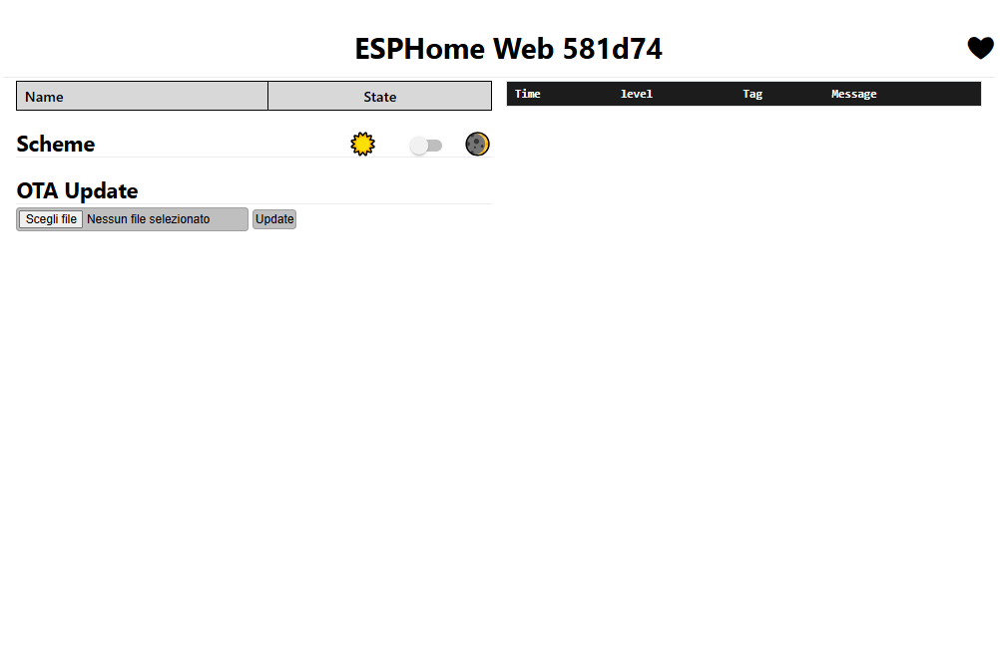

#### Flashing Using `esphome` via USB
If a direct connection to the board via USB is available, any firmware can be
flashed at any time in one step (i.e., there is no need to use the [Web
tool](#flashing-a-basic-firmware-using-the-web-tool) beforehand).

This task requires having the [`esphome` tool][esphome-command-line] available
on the host to which you have connected the board's USB port. The `esphome`
utility can be installed as a [Python package][esphome-python], but it is much
more convenient to use it via the readily available `esphome` Docker image.
* Connect the board via USB (see [How to connect the ESP32 board via
  USB](#how-to-connect-the-esp32-board-via-usb))
* Execute the following _one-liner_ to build and flash the complete
  `pc-power-board` firmware image ( :warning: be prepared, as build time
  may be rather long, especially the first time):
  ```
  # Adjust the following environment variable assignments as needed

  SERIAL_DEVICE=/dev/ttyUSB0
  BOARD_NAME=pc-power-board-YOURPREFERREDNAME
  YAML_FILE=pc-power-board.yaml
  CONFIG_DIR="${PWD}/config"
  # The following static network settings are embedded in the built
  # firmware image and then flashed to the board
  IP_ADDRESS=192.168.x.y
  IP_NETMASK=255.255.255.0
  IP_GATEWAY=192.168.x.z

  # GPIO pins used for input/output can be overridden by adding
  # the following extra -s options:
  #   -s power_led_gpio_pin GPIOXX
  #   -s power_button_gpio_pin GPIOXX
  # In the absence, defaults are taken from file pc-power-board.yaml.
  # Avoid using "strapping pins" (see https://esphome.io/guides/faq/#why-am-i-getting-a-warning-about-strapping-pins).

  sudo docker run --rm --privileged -v "${CONFIG_DIR}":/config --device=${SERIAL_DEVICE} -it ghcr.io/esphome/esphome \
        -s boardname ${BOARD_NAME} \
        -s ipaddress ${IP_ADDRESS} \
        -s ipnetmask ${IP_NETMASK} \
        -s ipgateway ${IP_GATEWAY} \
        run --device=${SERIAL_DEVICE} ${YAML_FILE}
  ```
  :information_source: _Note_  &mdash; Specifying `--device=${SERIAL_DEVICE}`
  twice is not an error: the first occurrence is a Docker option to enable
  passthrough of the serial device from the host to the container, whereas the
  second occurrence indicates to `esphome` the target device to flash the
  firmware to. Similarly, the first occurrence of `run` instructs Docker to
  create a container "on the fly" for the specified image and run its entrypoint
  process (`esphome` in this case), whereas the second occurrence of `run` is an
  argument to the `esphome` utility itself, indicating a build-then-flash task. 

If this flashing method has succeeded, the board should automatically connect to
your Wi-Fi network soon after being started up. You can check this in multiple
ways:
- by verifying whether a new device appears on your wireless router
- by checking boot-time messages emitted by the board on its USB-to-serial port:
  <details>
  <summary>(click to expand) Sample boot log for ESPHome firmware, showing the Wi-Fi connection stage</summary>

  ```
  ...
  [17:54:36.143][D][wifi:1382]: Found networks:
  [17:54:36.151][I][wifi:1353]: - 'network1' (AA:BB:CC:DD:EE:FF) ▂▄▆█ Ch: 6 -55dB P:0
  [17:54:36.162][I][wifi:1353]: - 'network2' (FF:EE:DD:CC:BB:AA) ▂▄▆█ Ch: 6 -91dB P:0
  [17:54:36.170][D][wifi:1739]: Retry phase: INITIAL_CONNECT → SCAN_CONNECTING
  [17:54:36.180][I][wifi:1064]: Connecting to 'network1' (AA:BB:CC:DD:EE:FF) (priority 0, attempt 1/2 in phase SCAN_CONNECTING)...
  [17:54:37.518][I][wifi:1475]: Connected
  [17:54:37.521][D][wifi:1492]: Disabling AP
  [17:54:37.527][C][wifi:1202]:   IP Address: 192.168.0.199
  [17:54:37.530][C][wifi:1213]:   SSID: 'network1'
  [17:54:37.532][C][wifi:1213]:   BSSID: AA:BB:CC:DD:EE:FF
  [17:54:37.535][C][wifi:1213]:   Hostname: 'test-node'
  [17:54:37.541][C][wifi:1213]:   Signal strength: -55 dB ▂▄▆█
  [17:54:37.541][C][wifi:1213]:   Channel: 6
  [17:54:37.544][C][wifi:1213]:   Subnet: 255.255.255.0
  [17:54:37.546][C][wifi:1213]:   Gateway: 192.168.0.1
  [17:54:37.546][C][wifi:1213]:   DNS1: 8.8.8.8
  [17:54:37.549][C][wifi:1213]:   DNS2: 0.0.0.0
  [17:54:37.553][W][component:462]: wifi cleared Warning flag
  [17:55:33.015][I][safe_mode:071]: Boot seems successful; resetting boot loop counter
  ```
  </details>

#### Flashing Using `esphome` via Wi-Fi
This method assumes that you have Wi-Fi access to the board, including knowing
its IP address, and that the board is already running an ESPHome firmware (like
the one used in this project). Similarly to the case of [Flashing Using
`esphome` via USB](#flashing-using-esphome-via-usb), the `esphome` utility is
required, and it is assumed to use its readily usable Docker image.

The process is straightforward, and can be carried out using the following
_one-liner_ ( :warning: once again, be prepared for a potentially long build
time):
```
# Adjust the following environment variable assignments as needed
BOARD_NAME=pc-power-board-YOURPREFERREDNAME
YAML_FILE=pc-power-board.yaml
CONFIG_DIR="${PWD}/config"
# The following network settings are used to reach the board for
# flashing in OTA mode
IP_ADDRESS=192.168.x.y
IP_NETMASK=255.255.255.0
IP_GATEWAY=192.168.x.z

# GPIO pins used for input/output can be overridden by adding
# the following extra -s options:
#   -s power_led_gpio_pin GPIOXX
#   -s power_button_gpio_pin GPIOXX
# In the absence, defaults are taken from file pc-power-board.yaml.
# Avoid using "strapping pins" (see https://esphome.io/guides/faq/#why-am-i-getting-a-warning-about-strapping-pins).

sudo docker run --rm -v "${CONFIG_DIR}":/config -it ghcr.io/esphome/esphome \
      -s boardname ${BOARD_NAME} \
      -s ipaddress ${IP_ADDRESS} \
      -s ipnetmask ${IP_NETMASK} \
      -s ipgateway ${IP_GATEWAY} \
      run --device=${IP_ADDRESS} ${YAML_FILE}
```


## 2. Building the Circuit
The circuit required to connect the ESP32 board to your desktop computer's
motherboard is pretty simple. Essentially, it leverages a couple of
opto-isolators (photocouplers), one for the input power LED signal and the other
for the output power button control: this keeps the `pc-power-board` separated
from your motherboard, including the grounds. In building the circuit, it is
therefore advised that no exposed components come in direct contact with the
motherboard and/or the computer chassis. A few resistors are added to keep
currents within safe limits (which should already be the case, considering the
motherboard's internal circuitry).

Depending on your level of "engagement", a custom PCB can be built/ordered for
this circuit. Personally, I am steadily running it on a breadboard, and I am
totally satisfied this way.

[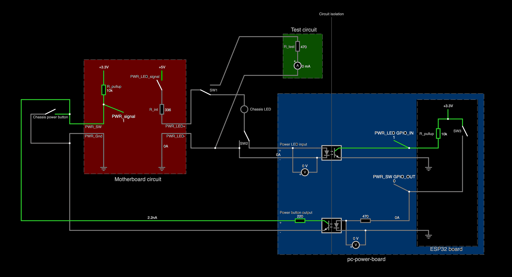][live-circuit]
[Large image](images/circuit-diagram.png)

:bulb: _Tip_ &mdash; You can click on the circuit diagram above to open a live
interactive simulation of the current flows using the excellent [circuit
simulator by Paul Falstad][circuitjs]: in this simulation, switches can be
flipped and buttons can be pushed to observe how the circuit works. This
repository includes the [circuit source file](pc-power-board.cjs1), to be used
with the [standalone off-line version][circuitjs-offline] of the same simulator.

As you can see, the diagram consists of 3 blocks:
* The blue block in the lower right, named _pc-power-board_, is the only one you
  need to build (excluding the rightmost part with black background, which
  represents the ESP32 board, and voltage meters, which have been added only for
  the purpose of the simulation). It should be fairly simple: just be careful
  about the orientation of the lower photocoupler, which is horizontally flipped
  for clarity; as a general rule, photocouplers have a notch marking pin 1 which
  corresponds to the anode, represented as red dot in this picture:\
  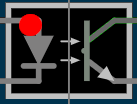\
  Here are the relevant circuit interfaces:
  * `PWR_LED_GPIO_IN` represents the GPIO pin from which the power LED status is
    received by the ESP32; the default pin, which can be changed at build time,
    is found inside file [`pc-power-board.yaml`](config/pc-power-board.yaml)
  * `PWR_SW_GPIO_OUT` represents the GPIO pin used to trigger the power button
    from the ESP32; the default pin, which can be changed at build time, is
    found inside file [`pc-power-board.yaml`](config/pc-power-board.yaml)
  * _Power LED input_ is the two-wire interface that has to be connected _in
    series_ with the desktop computer chassis power LED: this wiring has been
    chosen to minimize the current drop, so that the chassis power LED is not
    (too) dimmed after connecting the board; in the (unlikely) case that these
    two wires are shorted, this causes no harm at all to any components, because
    it simply reverts to the original chassis power LED circuit
  * _Power button output_ is the two-wire interface that has to be connected _in
    parallel_ with the desktop chassis power button
  * `SW3` inside the ESP32 board is meant to simulate activation of the GPIO pin
    controlling the power button: triggering it has the same effect as pushing
    the computer's power button

This is all you need to know to build the `pc-power-board` circuit. The
description of the following block helps understand how the board is meant to be
connected to the motherboard.

* The red block in the left side, named _Motherboard circuit_, roughly
  represents the relevant internal motherboard logic. The following components
  can be recognized:
  * `PWR_SW` and `PWR_Gnd` represent the 2 chassis power button pins on the
    motherboard's front panel header; using jumper wires, they can be connected
    to the `pc-power-board` as shown
  * `PWR_LED+` and `PWR_LED-` represent the 2 chassis power LED pins on the
    motherboard's front panel header; using jumper wires, they can be connected
    to the `pc-power-board` as shown\
    Two typical front panel header layouts are shown below:\
    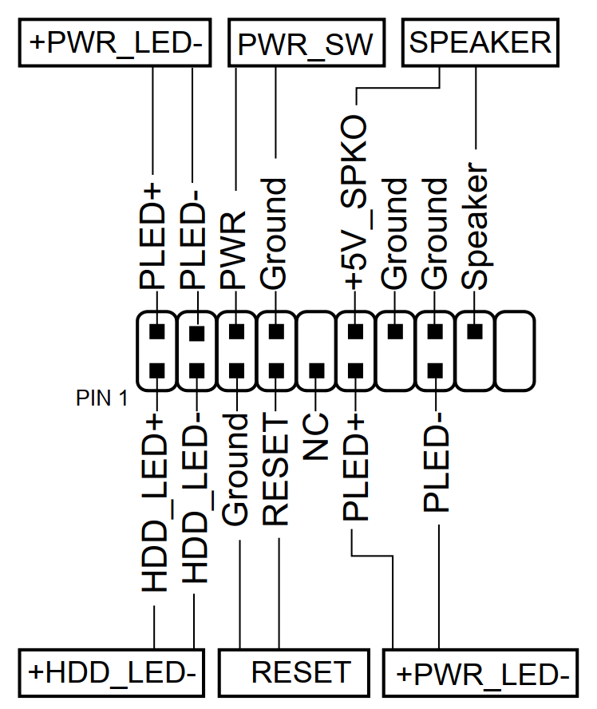
    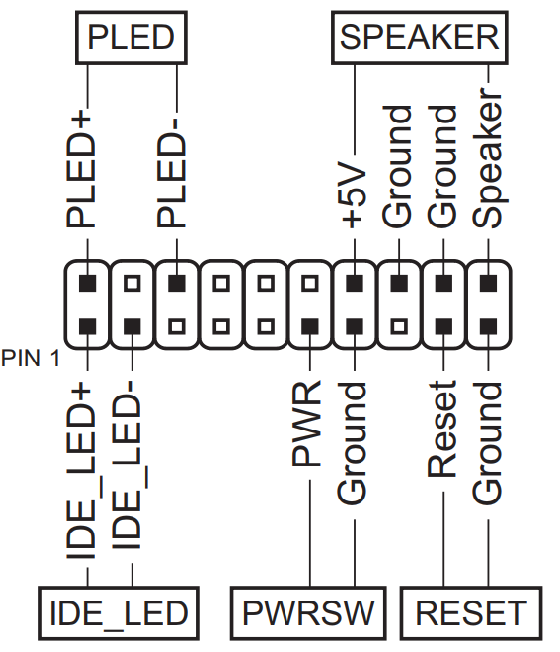
  * `PWR_signal` represents the power button push status, as theoretically
    detected by the motherboard
  * `PWR_LED_signal` represents the power-on computer status, as theoretically
    reported by the motherboard; in the simulated circuit it's an interactive
    switch
  * _Chassis power button_ and _Chassis LED_ should be self-explanatory, and
    they are both interactive in the simulation
  * `SW1` is there for simulation purposes only; its function is explained below
  * `SW2` is there for simulation purposes only; it can be used to toggle
    insertion of the `pc-power-board` circuit in the chassis power LED circuit

Finally, ensuring safe voltages and currents and, therefore, choosing reasonable
resistance values for the circuit design required some testing in the first
place, as detailed in the following block description.

* The green block in the upper part is only a temporary test circuit that I have
  used to measure the behavior of the `PWR_SW` and `PWR_LED` motherboard headers
  before building the final version of the `pc-power-board` circuit. Here are my
  findings:
  * in the normally open state, `PWR_SW` headers output `+3.3V` on 3 out of 3
    motherboards I have tested; since the chassis power button is a mechanical
    switch, the motherboard must have an internal pull-up resistor driving the
    positive pin
  * `PLED+` and `PLED-` headers output `+5V` without load (i.e., with the
    chassis power LED being disconnected) and with the computer powered on, on 3
    out of 3 motherboards I have tested. To verify that an internal resistor is
    used to drive the power LED, I have attached an additional `R_test` resistor
    with a known value and measured the flowing current: in the simulation, this
    test can be accomplished by flipping `SW1`. This confirmed the presence of
    an internal resistor in all the 3 motherboards I have tested, but with
    different resistance values ranging between `336Ω` and `500Ω`

:electric_plug: Power to the `pc-power-board` can be supplied by connecting its
USB port either to a USB charger or directly to the desktop computer, provided
that it continuously provides `+5V` voltage not only when powered down, but
particularly **also when AC power is restored after an outage**. The latter
choice enables full control of the board by direct communication between its
serial interface and the computer, thus allowing convenient debugging and
re-flashing.

Although not very refined, here is what the board may look like after being
assembled and connected to the computer (some of the wiring is hidden beyond or
under the board):\
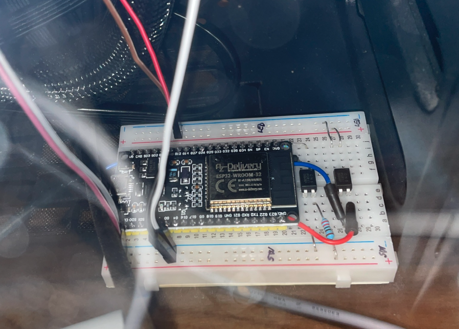


## 3. Setting up controls in OpenHAB
This guide assumes that you are running your own in-house installation of
[OpenHAB][openhab]: this is strongly advised to keep network communication with
the ESP32 board as delimited as possible (exposing the board to the Internet
would be extremely insecure).

In order to control `pc-power-board` using OpenHAB you need to:
* Install the [ESPHome binding][openhab-esphome]; instructions can be found
  [here][openhab-esphome-howto] but, essentially, the binding should natively be
  available in the OpenHAB marketplace/add-on store
* Set up a new Thing using the freshly installed binding\
  :information_source: _Note_ &mdash; In my case, adding a Thing explicitly
  using the ESPHome binding from OpenHAB's web GUI resulted in an empty web
  page, preventing both binding-specific discovery as well as manual addition:
  the only successful method has been to open the Inbox from the list of Things
  and add the `pc-power-board` (which had indeed been discovered) from there. If
  you incur the same issue, it is strongly advised to :warning: **immediately
  change the Thing UID at the time of adding it**: this prevents any settings
  thay you may want to customize on the newly added Thing from being overwritten
  by a subsequent background discovery process, which is a [long discussed
  issue/intended behavior][openhab-discovery-overwrite] of OpenHAB.
* Adjust the newly added Thing settings to point to the static IP address of the
  `pc-power-board` and use its configured API encryption key: the Thing should
  turn to the _Online_ status and several Channels should be exposed; at least:
  * the power LED status channel
  * two channels for the power button (one for the momentary press and the other
    for the long press)

  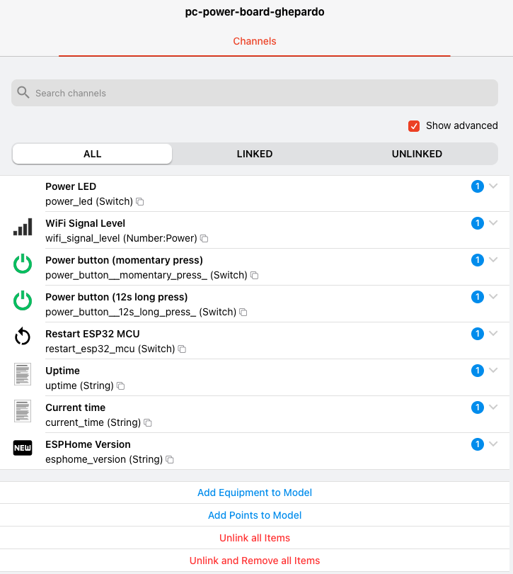
  
  :information_source: _Note_ &mdash; some of these
  channels may be hidden and require ticking the _Show advanced_ checkbox to be
  exposed

* Add Items to your house Model to map the discovered channels
* Create Pages and/or Dashboards to your liking in order to keep the power LED
  and switch handy


# Future Extensions  
`pc-power-board` can of course be improved. The following list suggests a few
examples, for which details are not provided since they are out of the scope of
this project:
* Add control of other system buttons and knobs: for example, the reset button,
  (part of) the internal case lighting, a case intrusion detection switch or
  even seleced keyboard buttons
* Implement a watchdog that power cycles a workstation in case of hard lock
* Adapt the circuitry to operate a device different from a desktop computer
* Turn to wired Ethernet connectivity, which can be added to an ESP32
  development board by suitable expansion modules: this can be helpful in case
  there is no Wi-Fi coverage or to improve reliability altogether (although I
  have never experienced any issues with Wi-Fi over several months of operation)


# References
Of course I am not the only one with this need, and there are many other
projects covering the same use case. Here is a quick comparison, not meant to be
exhaustive (only ESP-based projects are listed - no Arduinos):

| Reference                                                        | Chipset | Requires soldering | Power source           | Source code    | Power LED monitoring     | Power button control | Switch component      | Reset button control | Control interface | 
| :---:                                                            | :---:   | :---:              | :---:                  | :---           | :---:                    | :---:                | :---:                 | :---:                | :---              |
| _This project_                                                   | ESP32   | No (breadboard)    | USB                    | YAML (ESPHome) | :white_check_mark:       | :white_check_mark:   | Photocoupler          | :x:                  | OpenHAB           |
| [Fence (Poor man's IPMI)][ref01]                                 | ESP8266 | No (custom PCB)    | USB (?)                | C (Arduino)    | :white_check_mark:       | :white_check_mark:   | Photocoupler          | :x:                  | Web interface     |
| [ESP8266 based PC power controller][ref02]                       | ESP8266 | Optional           | ATX supply             | C (Arduino)    | :white_check_mark:       | :white_check_mark:   | None (direct to GPIO) | :white_check_mark:   | Custom            |
| [ESP32 Smart PC Power Controller][ref03]                         | ESP32   | No (breadboard)    | USB                    | C (Arduino)    | :x:                      | :white_check_mark:   | Relay                 | :x:                  | Web interface     |
| [How to turn your computer on and off remotely][ref04]           | ESP8266 | Yes                | USB                    | C (Arduino)    | :white_check_mark:       | :white_check_mark:   | Photocoupler          | :white_check_mark:   | Mobile app        |
| [Wake-On-ESP32][ref05]                                           | ESP32   | Optional           | USB                    | YAML (ESPHome) | :white_check_mark:       | :white_check_mark:   | Photocoupler          | :white_check_mark:   | Home Assistant    |
| [ESPHome PC Power Control via Home Assistant][ref06]             | ESP8266 | Yes                | Motherboard USB header | YAML (ESPHome) | via reset button voltage | :white_check_mark:   | Transistor            | :x:                  | Home Assistant    |
| [DIY out-of-band management: remote power button][ref07]         | ESP32   | No (breadboard)    | Motherboard USB header | YAML (ESPHome) | :x:                      | :white_check_mark:   | MOSFET                | :x:                  | MQTT              |
| [Remote_PC_Switcher][ref08]                                      | ESP32   | No (breadboard)    | ATX supply             | C (ESP-IDF)    | :x:                      | :white_check_mark:   | Transistor            | :x:                  | Custom            |
| [ESP32-based Smart Switch for PC without WOL][ref09]             | ESP32   | No                 | Motherboard USB header | YAML (ESPHome) | :x:                      | :white_check_mark:   | Relay                 | :x:                  | Home Assistant    |
| [WeMos ESP8266 Remote PC Switch][ref10]                          | ESP8266 | No (breadboard)    | USB                    | C (Arduino)    | :white_check_mark:       | :white_check_mark:   | Transistor            | :x:                  | MQTT              |

Although less on focus, the following pointers may also be relevant:
* [I wake my home PC from anywhere using an ESP32 and
  MQTT](https://www.xda-developers.com/i-wake-my-home-pc-from-anywhere-using-an-esp32-and-mqtt/)
  is a guide describing how to use an ESP32 board to send WoL packets when
  triggered via MQTT by a mobile application.
* [Wake-on-LAN_ESP32](https://github.com/sergio-isidoro/Wake-on-LAN_ESP32) is
  similar, but also supports sending special UDP packets to shut down the target
  computer (a custom listener software is required for this), and such actions
  can be triggered by pressing a physical button connected to the board.
* [This thread on the Arduino
  forum](https://forum.arduino.cc/t/solved-power-pc-by-mimicking-the-on-off-btn-optocoupler-transistor-relay/644022)
  discusses the convenience of choosing relays, transistors or optocouplers to
  separate the desktop computer circuitry from the control board.
* [Another thread on the Arduino
  forum](https://forum.arduino.cc/t/powering-on-pc-with-esp/1201458) discusses
  the use case of an ESP8266-based implementation to control power LED, power
  button and reset button. The origin of this implementation is found in [a
  blog](https://www.ajfriesen.com/) describing several revisions of a custom
  "`pc-switch`" board running ESPHome, which has later been renamed to
  [PokyPow](https://www.crowdsupply.com/ajfriesen/pokypow), a project supported
  by a crowdfunding campaign.


[wakeonlan]: https://en.wikipedia.org/wiki/Wake-on-LAN
[arch-linux-wol]: https://wiki.archlinux.org/title/Wake-on-LAN
[pikvm]: https://pikvm.org/
[circuitjs]: https://www.falstad.com/circuit/
[circuitjs-offline]: https://www.falstad.com/circuit/offline/
[live-circuit]: https://www.falstad.com/circuit/circuitjs.html?ctz=CQAgjCAMB0l3BWcMBMcUHYMGZIA4UA2ATmIxAUgoqoQFMBaMMAKAHMRjCRcAWT7tmzcqkFgCcB4YiilcoPYSzCFZwvFPXTZsgCZ0AZgEMArgBsALgzN1d4BaNitekcoXwhMs9xux5+rAAeFEhgvMQgeNjgCLIBsgBKAPoAlgB2FhIUvPwM2LIIOSAM8lS8GGIA7jz+nhgFKBpeUCzVsU31ID51smIADhSNPLFdHtgj0VQQYPCzrYMdDb4jVaO+kPzd470swX7kYRq8CNxgCBDxIADCABZGAM73KfcAOvcAMgCiACLz8igoAIyTyAlrBcIRBgICIIITFE4gS7JCx0e6ZABGxRUEAYaHAGEECHIYmCDHcNQgxH4fn4AQ0AFkAPYWG50cToxlGcS6N4AYxS4l5JhSmWq2x4GzWEoCu08hUiSEaVDwR3AsgAygB1ILDfhECB+KhEWlqkBalDzCp6zrEMA6TqrK3SzgE51iDhkQSSz2KEQte5ybjyfIKCDGMz3OhZGYeMCumOLUNzUlHZVHaKXAAKmuSX2+SSebDSRjMsqp3ABEVI0RQIaRST65jMJj6LASmlkpQciNo3ZgCD+Xv4-1BrGq8jAwMnsmnLWqjQ0wcIi5E81nAKB9p21XXnWazTE6u0kSNKpPoZA4cjCgtO+BeCmU+BYmwFWyuRDhWpahv83F+73B0WExVRuCYSAkHCbheAgElBlkJgwGidxyEQspwA0AAVVELD5AUhRFeYALUZceG3Twz0IakRhKVcxRo+Qv2KUp5iYkMtBDMR2xmFx8VODYpiGUQex4aBJgcaABxcNwPHObwPG6GYUAHAM8mEcByVxWNySmEALHEEwow4WiQVyYN1NELITLtDQTM45B4DbZjBAQrthN47AxL7STZTyFAIjjXIUDCfFyEuW4HieV57j6RlKjZN50RMCwLEZNIWCPLRZy0A8FCvOhf3otRJX-IDJG6OTEUYu0bzQXy8CQHBij8EBXXrRszGbVtqi0poEV69852KNANCYiqilWPJSOYBCtEqya5pqqCKBqsdkDPON+N4zahttOIVE4Gr5qyJ1KqiAoarKCp2BdbgmJ9E5hMdUj7tdJixADGYNvjfA+r9CB9MMtdfrlfizxg1cBlO4ECVG4FxKmWZHOqaHZFOy7LUlJjYcG57RqKHHoR2Xhay6fqVCoQgEUIOMWi0PaekiXgmm26hs1zH43gAcUzABJAB5JJeYAORYemloO-xfFqCAkHZpItW5vnBf5gBVTCxdI6yhiYU5yVlkB5cLYtSx6icdYnZ95hMjdho8W3JpG49rKt8EGs8KiKAwRVCDC01MzihKPk5p40kbTI3cgvAYWBcI4n9wPxES5LUrSN5GWS8PgMRDAqxnM4IlUfg4JppBdbceRdZNGqrnw4VcKixkzCMCwUjS2VmZ0WpmYiRo-Zql5Wzd6kQuZ8hsFpy4GA792EHlZnRqJRFTWn4f4Kq2XlOXgeh9ahTjkibBNmZ7eND6XkGFi+LxAYDkuV0YHYx+7bXVWBNGYZg9s+IbAY9OJCDgYx6k7W2A1lJ0TthoCmkDjwLXUtAtSFYERwKQWBEByDrZZRqgNGaQ0cHYKdtAuCX1PCSjjDWVw29ZDyzzIPWUzAIC1gOE1QE6Eao0J+KvLES80BgRmBQiIWYcwK01L5M4TRXxYkgIw3iQjkhczSA-YIxA8AQBpjOEGpdT4gE+OqTM+REqcm5MDcGB0GYQyGudFanYjqrXoRBJoeIvp6lJpcLU2AxZQJAAAMVgvYGMVAmAgASKiZ4FgjBpF5FGIAA

[esphome]: https://esphome.io/
[esphome-board-connection]: https://esphome.io/guides/physical_device_connection/#connecting-to-the-esp
[esp-web-tools]: https://esphome.github.io/esp-web-tools/
[google-usb-serial-hid]: https://support.google.com/chrome/answer/12576972
[webserial-compatibility-matrix]: https://developer.mozilla.org/en-US/docs/Web/API/Web_Serial_API#browser_compatibility
[esphome-command-line]: https://esphome.io/guides/getting_started_command_line/
[esphome-python]: https://esphome.io/guides/installing_esphome/
[esphome-docker]: https://hub.docker.com/r/esphome/esphome
[esphome-api]: https://esphome.io/components/api.html
[esphome-api-key-generator]: https://esphome.io/components/api/#configuration-variables
[esphome-ota-password-update]: https://esphome.io/components/ota/esphome/#updating-the-password
[aioesphomeapi]: https://github.com/esphome/aioesphomeapi

[openhab]: https://www.openhab.org
[openhab-discovery-overwrite]: https://github.com/openhab/openhab-core/issues/3753
[openhab-esphome]: https://github.com/seime/openhab-esphome
[openhab-esphome-howto]: https://github.com/seime/openhab-esphome?tab=readme-ov-file#getting-started-for-non-esphome-users
[homeassistant]: https://www.home-assistant.io

[azdelivery-mcu]: https://www.az-delivery.de/it/products/esp32-developmentboard
[azdelivery-mcu-docs]: https://www.az-delivery.de/collections/kostenlose-e-books/products/esp32-nodemcu-kostenfreies-e-book?variant=8687877685344
[esp32-wroom-32-docs]: https://documentation.espressif.com/esp32-wroom-32d_esp32-wroom-32u_datasheet_en.pdf
[sharp-pc817]: https://global.sharp/products/device/lineup/data/pdf/datasheet/PC817XxNSZ1B_e.pdf
[cp210x-driver]: https://www.silabs.com/software-and-tools/usb-to-uart-bridge-vcp-drivers?tab=downloads

[putty]: https://putty.software/
[modern-standby-wake]: https://learn.microsoft.com/en-us/windows-hardware/design/device-experiences/modern-standby-wake-sources

[ref01]: https://github.com/alessandrocarminati/fence-dev
[ref02]: https://github.com/SilverFire/esp8266-pc-power-control
[ref03]: https://github.com/fnskye/ESP32PCRemote
[ref04]: https://noisycarlos.com/project/how-to-turn-your-computer-on-and-off-remotely/
[ref05]: https://www.reddit.com/r/esp32/comments/17c5n9r/power_on_pc_with_esp32/
[ref06]: https://github.com/Erriez/ESPHomePCPowerControlHomeAssistant
[ref07]: https://michael.stapelberg.ch/posts/2022-10-09-remote-power-button/
[ref08]: https://github.com/epic-tetus/Remote_PC_Switcher?tab=readme-ov-file
[ref09]: https://aarongorka.com/blog/esp32-based-smart-switch-for-pc-without-wol/
[ref10]: https://www.hackster.io/zvonko-bockaj/wemos-esp8266-remote-pc-switch-062c7a
